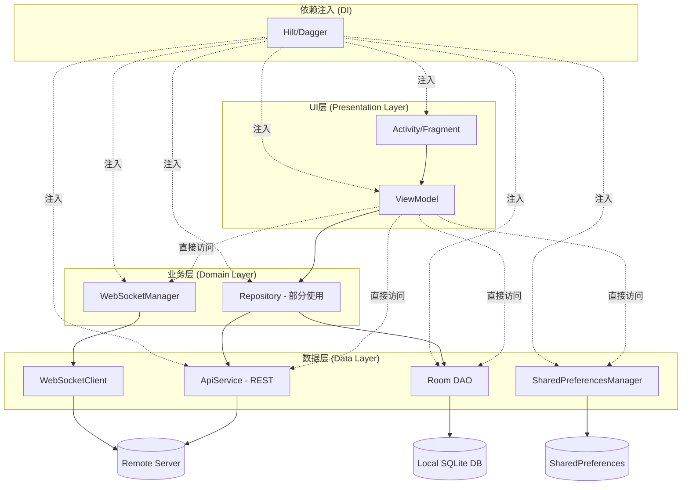
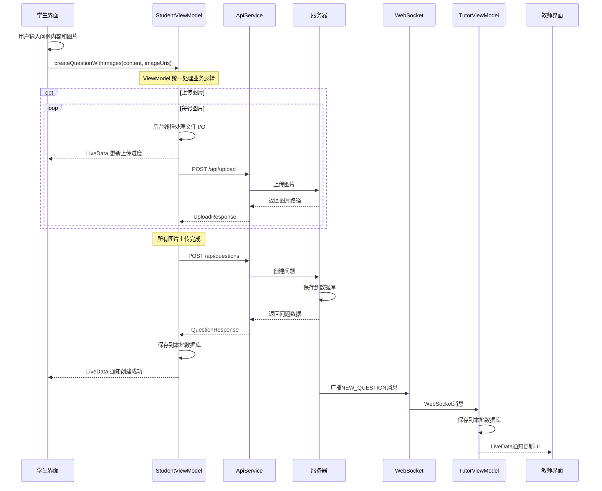
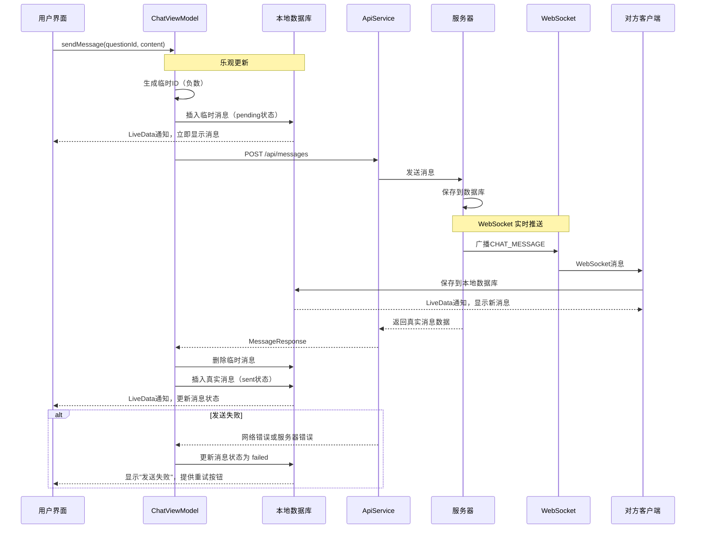
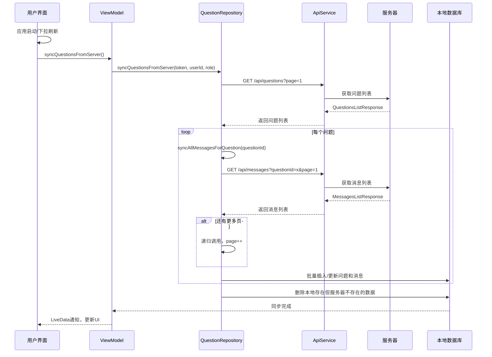
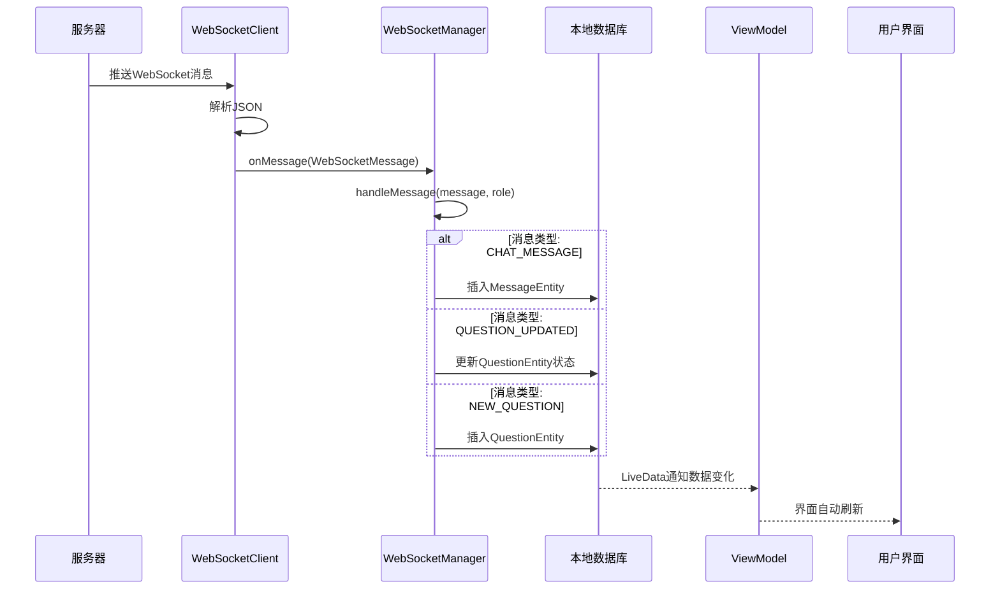
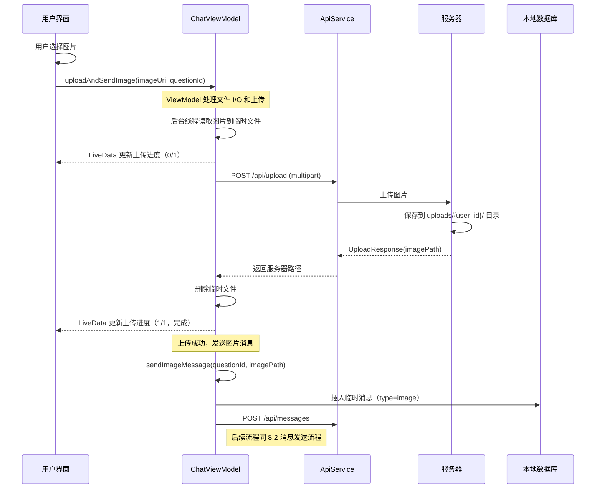
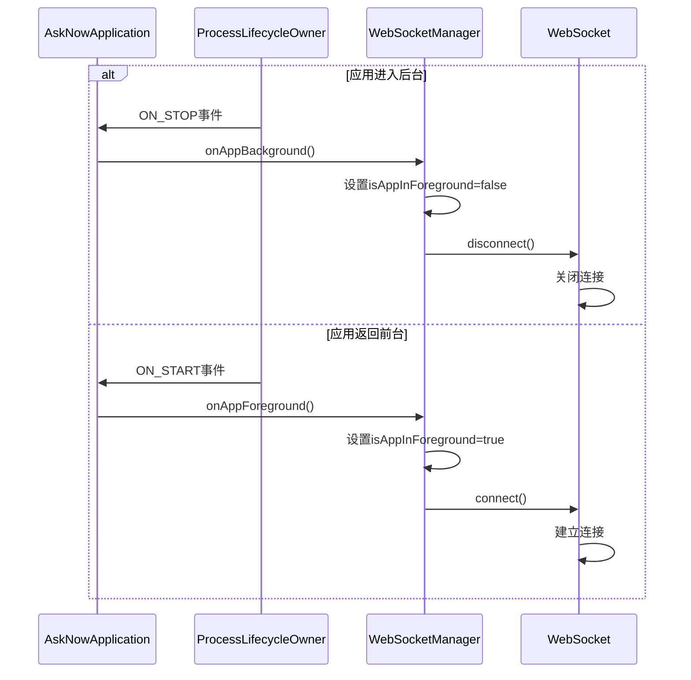

# Android 类架构文档

## 1. 项目概述

### 1.1 应用简介

AskNow是一个师生问答系统的Android客户端，为学生和教师提供实时问答和交流平台。学生可以发布问题（支持文字和图片），教师可以接取问题并进行在线答疑。

### 1.2 技术栈

- **架构模式**: MVVM (Model-View-ViewModel)
- **依赖注入**: Hilt/Dagger 2
- **数据库**: Room Persistence Library
- **网络请求**: Retrofit 2 + OkHttp 3
- **实时通信**: WebSocket (OkHttp)
- **响应式编程**: LiveData
- **图片加载**: Glide 4
- **UI组件**: Material Design 3, ViewBinding, RecyclerView, ViewPager2
- **线程管理**: ExecutorService, Handler
- **JSON解析**: Gson

### 1.3 整体架构图



**架构说明**:

- **实线箭头**: 理想的分层调用路径（通过 Repository）
- **虚线箭头**: 实际项目中的直接访问路径
- **实用主义混合架构**: 大多数 ViewModel 直接访问 ApiService 和 DAO，Repository 仅在复杂业务场景使用
- **完全符合 MVVM**: View 层不包含业务逻辑，所有数据访问都在 ViewModel 或 Repository 中处理

### 1.4 架构实现细节

#### ViewModel 与数据层的交互模式

**模式一：直接访问（用于简单操作）**
```java
// AuthViewModel - 登录操作
@Inject
public AuthViewModel(ApiService apiService, ...) {
    this.apiService = apiService;
}

public void login(String username, String password) {
    apiService.login(request).enqueue(callback);
}
```

**模式二：通过 Repository（用于复杂业务）**
```java
// ChatViewModel - 标记已读（需要本地+服务器同步）
@Inject
public ChatViewModel(MessageRepository messageRepository, ...) {
    this.messageRepository = messageRepository;
}

public void markMessagesAsRead(long questionId) {
    messageRepository.markMessagesAsRead(token, questionId, userId, callback);
}
```

**模式三：混合使用（根据操作复杂度选择）**
```java
// ChatViewModel - 同时使用两种模式
public class ChatViewModel {
    private final ApiService apiService;           // 直接用于发送消息
    private final MessageDao messageDao;            // 直接用于查询消息
    private final MessageRepository messageRepository; // 用于复杂的标记已读逻辑
}
```

#### 架构设计理念

**何时使用 Repository**:
- 需要复杂的数据同步逻辑（本地 + 服务器）
- 需要重试机制和网络状态监听
- 需要递归分页加载和数据一致性维护
- 多个数据源的协调处理

**何时直接访问**:

- 简单的 REST API 调用（登录、注册、创建问题）
- 单一数据源查询（查询本地消息列表）
- 一次性操作，无需复杂错误处理
- 避免过度工程化，保持代码简洁

**架构优势**:
1. **灵活性**: 根据业务复杂度选择合适的模式
2. **简洁性**: 避免为简单操作创建不必要的 Repository 类
3. **可扩展性**: 复杂业务逻辑集中在 Repository，易于维护
4. **符合 MVVM**: View 层完全不涉及数据访问，保持架构纯净

---

## 2. 核心架构模块

### 2.1 应用层 (Application)

#### **AskNowApplication.java**
**职责**: 应用入口类，全局资源管理和生命周期监听

**主要功能**:
- 启用Material You动态颜色主题
- 注册应用生命周期监听器 (`ProcessLifecycleOwner`)
- 自动管理WebSocket连接（前台/后台切换）
- 内存级别监控和资源清理 (`onTrimMemory`)
- 全局资源清理 (`cleanup()`)

**关键代码模式**:
```java
@HiltAndroidApp
public class AskNowApplication extends Application implements LifecycleEventObserver
```

**设计模式**: 单例模式、观察者模式

---

### 2.2 基础架构 (base)

#### **BaseViewModel.java**
**职责**: ViewModel基类，提供通用功能

**提供的通用功能**:
- 线程池管理 (`executor`)
- 错误消息管理 (`errorMessage`)
- 加载状态管理 (`loading`)
- 分页状态管理 (`currentPage`, `hasMoreData`, `isLoadingMore`)
- 同步状态管理 (`isSyncing`)
- 统一的错误处理 (`handleError`, `getDetailedErrorMessage`)
- 线程切换工具 (`executeInBackground`, `executeOnIO`, `executeOnMain`)
- 资源清理 (`cleanup()`, `onCleared()`)

**设计模式**: 模板方法模式

---

### 2.3 依赖注入模块 (di)

#### **NetworkModule.java**
**职责**: 提供网络相关的依赖注入

**提供的依赖**:
- `Gson`: JSON解析器
- `HttpLoggingInterceptor`: HTTP日志拦截器
- `OkHttpClient`: HTTP客户端（配置超时、重试、连接池、ping间隔）
- `Retrofit`: REST API客户端
- `ApiService`: API接口实现
- `WebSocketUrl`: WebSocket连接地址

**配置要点**:
- 连接超时: 15秒
- 读写超时: 30秒
- 总超时: 60秒
- WebSocket ping间隔: 30秒（自动心跳）
- 连接池: 最多5个空闲连接，保持5分钟

#### **DatabaseModule.java**
**职责**: 提供数据库相关的依赖注入

**提供的依赖**:
- `AppDatabase`: Room数据库实例
- `QuestionDao`: 问题数据访问对象
- `MessageDao`: 消息数据访问对象

**数据库迁移**:
- Migration 4→5: 添加 `isRead` 字段
- Migration 5→6: 添加 `sendStatus` 字段
- Migration 7→8: 删除 `pending_messages` 表

#### **ExecutorModule.java**
**职责**: 提供统一的线程池管理

**提供的线程池**:
- `@Named("io")`: IO线程池（CPU核心数 * 2 + 1个线程）
- `@Named("computation")`: 计算线程池（CPU核心数个线程）
- `@Named("single")`: 单线程池（顺序执行）
- `@Named("scheduled")`: 定时任务线程池

---

## 3. 数据层 (data)

### 3.1 网络API (data.api)

#### **ApiService.java**
**职责**: 定义REST API接口

**API端点**:
- **认证**: `POST /api/register`, `POST /api/login`
- **问题**: `GET /api/questions`, `POST /api/questions`, `POST /api/questions/accept`, `POST /api/questions/close`
- **消息**: `GET /api/messages`, `POST /api/messages`, `POST /api/messages/mark-read`
- **上传**: `POST /api/upload` (multipart/form-data)

#### **WebSocketClient.java**
**职责**: WebSocket客户端封装，管理连接和重连

**主要功能**:
- 自动重连（指数退避算法）
- 最大重连次数: 10次
- 退避延迟: 1s, 2s, 4s, 8s, 16s, 30s
- 手动断开控制
- 重连线程中断机制

**设计模式**: 策略模式（重连策略）

---

### 3.2 本地数据库 (data.local)

#### **AppDatabase.java**
**职责**: Room数据库配置

**数据库版本**: 8

**实体表**:
- `questions`: 问题表
- `messages`: 消息表

#### **QuestionDao.java**
**职责**: 问题数据访问对象

**主要查询**:
- `getQuestionsByUserId()`: 获取学生的问题列表
- `getQuestionsByStatus()`: 按状态查询问题
- `getQuestionsByTutorAndStatus()`: 获取教师接取的问题
- `getQuestionByIdLive()`: LiveData实时监听单个问题

#### **MessageDao.java**
**职责**: 消息数据访问对象

**主要查询**:
- `getMessagesByQuestionId()`: 获取问题的消息列表
- `getUnreadMessageCount()`: 获取未读消息数量
- `markMessagesAsRead()`: 标记消息为已读
- `updateSendStatus()`: 更新消息发送状态

#### **QuestionEntity.java**
**职责**: 问题实体类

**字段**:
- `id`: 问题ID（主键）
- `userId`: 提问用户ID
- `tutorId`: 接取教师ID（可空）
- `content`: 问题内容
- `imagePaths`: 图片路径（JSON字符串）
- `status`: 问题状态（pending/in_progress/closed）
- `createdAt`, `updatedAt`: 时间戳

**索引优化**: 为 userId, status, tutorId, createdAt, updatedAt 建立索引

#### **MessageEntity.java**
**职责**: 消息实体类

**字段**:
- `id`: 消息ID（主键）
- `questionId`: 关联问题ID（外键）
- `senderId`: 发送者ID
- `content`: 消息内容
- `messageType`: 消息类型（text/image）
- `isRead`: 是否已读
- `sendStatus`: 发送状态（pending/sent/failed）
- `createdAt`: 时间戳

**外键**: CASCADE删除（删除问题时自动删除消息）

---

### 3.3 数据模型 (data.model)

#### 请求模型
- **LoginRequest**: 登录请求（username, password）
- **RegisterRequest**: 注册请求（username, password, role）
- **QuestionRequest**: 创建问题请求（content, imagePaths）
- **MessageRequest**: 发送消息请求（questionId, content, messageType）

#### 响应模型
- **LoginResponse**, **RegisterResponse**: 认证响应（success, message, token, user）
- **QuestionResponse**, **QuestionsListResponse**: 问题响应
- **MessageResponse**, **MessagesListResponse**: 消息响应
- **UploadResponse**: 上传响应（success, message, imagePath）

#### **Pagination.java**
**职责**: 分页信息模型

**字段**:
- `page`: 当前页码
- `pageSize`: 每页大小
- `total`: 总记录数
- `totalPages`: 总页数
- `hasMore()`: 是否还有更多数据

#### **WebSocketMessage.java**
**职责**: WebSocket消息模型

**字段**:
- `type`: 消息类型（ACK, CHAT_MESSAGE, QUESTION_UPDATED等）
- `data`: JsonObject数据
- `timestamp`: 时间戳
- `messageId`: 消息ID

#### **UploadProgress.java**
**职责**: 图片上传进度数据类

**字段**:
- `current`: 当前已完成的数量
- `total`: 总数量
- `isComplete`: 是否完成
- `error`: 错误信息（如果有）

**工厂方法**:
- `inProgress(current, total)`: 创建进行中的进度对象
- `complete(total)`: 创建完成的进度对象
- `error(current, total, error)`: 创建失败的进度对象

**使用场景**: StudentViewModel 和 ChatViewModel 的图片上传进度通知

---

### 3.4 仓储层 (data.repository)

#### **MessageRepository.java**
**职责**: 消息业务逻辑、网络状态监听、标记已读

**主要功能**:
- 标记消息为已读（本地数据库 + 服务器同步）
- 获取未读消息数量
- 监控网络状态（`ConnectivityManager.NetworkCallback`）
- 网络恢复时通知监听器
- 带重试机制的标记已读（指数退避）

**设计模式**: 仓储模式、观察者模式

#### **QuestionRepository.java**
**职责**: 问题同步、分页加载、数据一致性

**主要功能**:
- 从服务器同步问题到本地
- 递归获取每个问题的所有分页消息
- 数据一致性维护（删除本地存在但服务器不存在的数据）
- 支持刷新模式和追加模式

**关键算法**: 递归分页加载
```java
syncAllMessagesForQuestion(authHeader, questionId, allMessages, currentPage, callback)
```

**设计模式**: 仓储模式、递归模式

---

## 4. 业务层 (ui)

### 4.1 认证模块 (ui.auth)

#### **AuthViewModel.java**
**职责**: 认证业务逻辑

**主要功能**:
- 用户登录
- 用户注册
- 保存用户数据到SharedPreferences
- 自动连接WebSocket

**设计模式**: MVVM模式

#### **LoginActivity.java**, **RegisterActivity.java**
**职责**: 登录/注册界面

**主要功能**:
- 输入验证（`ValidationUtils`）
- 错误提示（`TextInputLayout.setError`）
- 加载状态显示
- 根据角色跳转到对应主界面

---

### 4.2 学生端模块 (ui.student)

#### **StudentViewModel.java**
**职责**: 学生业务逻辑

**继承**: `BaseQuestionListViewModel`

**主要功能**:
- 创建新问题（带图片上传）
- 查看自己提出的问题
- 监听新回答消息

**核心方法**:
- `createQuestionWithImages(String content, List<Uri> imageUris)`: 统一处理图片上传和问题创建
- `uploadImages()`: 批量上传图片（私有方法）
- `uploadNextImage()`: 递归上传下一张图片
- `uploadImageFile()`: 上传单个图片文件

**LiveData**:
- `uploadProgress`: 上传进度通知
- `questionCreated`: 问题创建结果通知

#### **StudentMainActivity.java**
**职责**: 学生主界面

**主要功能**:
- 显示问题列表Fragment
- 延迟同步数据（避免阻塞UI）
- 提供"发布问题"和"退出登录"菜单

#### **PublishQuestionActivity.java**
**职责**: 发布问题界面

**主要功能**:
- 多图片选择（最多9张）
- 图片预览和删除
- 内容验证（10-1000字符）
- 观察 ViewModel 的上传进度和创建结果

**架构实现**:
- 遵循 MVVM 架构，不直接调用网络层
- 所有业务逻辑在 ViewModel 中处理
- 通过 `viewModel.createQuestionWithImages(content, imageUris)` 提交问题
- 观察 `uploadProgress` 和 `questionCreated` LiveData 更新 UI

**UI 响应**:
- 实时显示上传进度
- 上传完成后自动跳转
- 错误时显示提示并恢复状态

#### **QuestionDetailActivity.java**
**职责**: 学生查看问题详情界面

**主要功能**:
- 显示问题内容和图片
- 消息列表（RecyclerView）
- 发送文本/图片消息
- 智能滚动（仅在底部时自动滚动）
- 自动标记已读
- 根据问题状态禁用输入

**架构实现**:
- 遵循 MVVM 架构，通过 ViewModel 处理所有业务逻辑
- 图片上传通过 `chatViewModel.uploadAndSendImage()` 处理
- 观察 LiveData 实时更新 UI
- 生命周期安全的消息标记已读机制

#### **QuestionListFragment.java**
**职责**: 学生问题列表Fragment

**继承**: `BaseQuestionListFragment`

**特点**: 复用基类的所有功能，只需指定ViewModel和详情页Activity

---

### 4.3 老师端模块 (ui.tutor)

#### **TutorViewModel.java**
**职责**: 教师业务逻辑

**继承**: `BaseQuestionListViewModel`

**特有功能**:
- 获取待接取的问题（PENDING）
- 获取进行中的问题（IN_PROGRESS）
- 获取已完成的问题（CLOSED）
- 监听新问题消息

#### **TutorMainActivity.java**
**职责**: 教师主界面

**主要功能**:
- ViewPager2 + TabLayout（三个Tab）
- Tab 1: 待接取问题
- Tab 2: 进行中问题
- Tab 3: 已完成问题

#### **AnswerActivity.java**
**职责**: 教师回答问题界面

**主要功能**:
- 显示问题详情
- 接受问题按钮（PENDING状态）
- 关闭问题按钮（IN_PROGRESS状态）
- 消息列表和发送功能
- 根据问题状态动态更新按钮和输入框状态
- 使用LiveData观察问题状态变化（自动更新UI）

**架构实现**:
- 遵循 MVVM 架构，通过 ViewModel 处理所有业务逻辑
- 图片上传通过 `chatViewModel.uploadAndSendImage()` 处理
- 观察 LiveData 实时更新 UI
- 智能的按钮状态管理

#### **QuestionListByStatusFragment.java**
**职责**: 按状态分类的问题列表Fragment

**特点**: 根据传入的status参数显示不同状态的问题

---

### 4.4 聊天模块 (ui.chat)

#### **ChatViewModel.java**
**职责**: 聊天业务逻辑

**主要功能**:
- 发送文本消息
- 发送图片消息
- **乐观更新模式**: 先插入临时消息（pending状态），发送成功后替换为真实消息
- 消息重试机制
- 接受问题（教师端）
- 关闭问题
- 标记消息为已读

**核心方法**:
- `uploadAndSendImage(Uri imageUri, long questionId)`: 上传图片并发送图片消息
- `uploadImageAndSend()`: 上传图片文件（私有方法）
- `handleUploadError()`: 统一的上传错误处理
- `sendMessage()`: 发送文本消息
- `sendImageMessage()`: 发送图片消息
- `retryMessage()`: 重试发送失败的消息

**LiveData**:
- `uploadProgress`: 图片上传进度通知
- `messageSent`: 消息发送成功通知
- `errorMessage`: 错误信息通知

**关键技术**:
- `AtomicLong`: 生成唯一的临时消息ID（负数）
- `synchronized`: 保护临时消息的删除和插入操作
- 防抖机制: 避免重复发送和上传
- 后台线程处理文件 I/O

**设计模式**: 乐观更新模式、命令模式

---

### 4.5 问题模块基类 (ui.question)

#### **BaseQuestionListFragment.java**
**职责**: 问题列表Fragment的基类

**合并的公共逻辑**:
- RecyclerView设置和优化
- 下拉刷新（SwipeRefreshLayout）
- 滚动加载更多
- 未读消息数量更新
- 空数据提示

**子类需实现**:
- `getViewModel()`: 返回具体的ViewModel
- `getDetailActivityClass()`: 返回详情页Activity

**设计模式**: 模板方法模式

#### **BaseQuestionListViewModel.java**
**职责**: 问题列表ViewModel的基类

**合并的公共逻辑**:
- 问题列表查询
- 分页加载
- 下拉刷新
- WebSocket消息监听
- 资源清理

**子类需实现**:
- `getQuestions()`: 返回具体的问题列表LiveData
- `getWebSocketMessageType()`: 返回需要监听的WebSocket消息类型

**设计模式**: 模板方法模式

---

### 4.6 图片模块 (ui.image)

#### **ImagePreviewActivity.java**
**职责**: 图片预览界面

**主要功能**:
- ViewPager2多图浏览
- 支持缩放、拖动（PhotoView）
- 图片指示器（1/3）
- 点击切换工具栏显示/隐藏
- Edge-to-edge沉浸式布局

**技术要点**:
- `WindowInsetsControllerCompat`: 控制系统栏显示/隐藏（Android 11+）
- `ViewCompat.setOnApplyWindowInsetsListener`: 处理系统栏insets

#### **ImagePreviewAdapter.java**
**职责**: 图片预览ViewPager适配器

**技术**:
- 使用PhotoView提供流畅的缩放体验
- 配置最大缩放4倍、中等缩放2倍
- Glide加载高清大图

---

### 4.7 适配器 (ui.adapter)

#### **MessageAdapter.java**
**职责**: 消息列表适配器

**ViewType**:
- `TYPE_SENT`: 发送的消息（右侧）
- `TYPE_RECEIVED`: 接收的消息（左侧）
- `TYPE_LOADING`: 加载更多Footer

**主要功能**:
- DiffUtil优化列表更新
- 显示文本/图片消息
- 显示消息发送状态（pending/sent/failed）
- 消息重试按钮
- 未读标记显示

**设计模式**: 适配器模式、DiffUtil优化

#### **QuestionAdapter.java**
**职责**: 问题列表适配器

**主要功能**:
- DiffUtil优化列表更新
- 显示问题内容、状态、日期
- 显示未读消息数量徽章（异步查询）
- 加载更多Footer
- 重试Footer

#### **ImageDisplayAdapter.java**
**职责**: 图片展示适配器（只读）

**用途**: 显示问题详情页的图片列表

**功能**: 加载服务器图片缩略图、点击预览

#### **ImageSelectionAdapter.java**
**职责**: 图片选择适配器（支持删除）

**用途**: 发布问题时显示选择的本地图片

**功能**: 加载本地图片、删除图片、点击预览

#### **BaseLoadingFooterViewHolder.java**
**职责**: 加载更多底部ViewHolder基类

**功能**:
- 显示加载中状态（ProgressBar）
- 显示重试按钮
- 统一处理重试逻辑

#### **TutorQuestionsPagerAdapter.java**
**职责**: 教师端ViewPager2适配器

**功能**: 创建三个Fragment（pending, in_progress, closed）

---

## 5. 工具类 (utils)

### **WebSocketManager.java**
**职责**: WebSocket连接管理、消息分发、前后台切换

**主要功能**:
- 连接/断开/重连WebSocket
- 分发WebSocket消息到本地数据库
- 前后台切换自动管理连接
- 处理不同类型的WebSocket消息:
  - `ACK`: 确认消息
  - `CHAT_MESSAGE`: 聊天消息（插入数据库）
  - `QUESTION_UPDATED`: 问题状态更新（只更新状态字段，保留imagePaths）
  - `NEW_QUESTION`: 新问题（教师端）
- 网络恢复监听器

**关键技术**:
- 使用`executor.execute()`异步处理消息
- 保留imagePaths字段，避免WebSocket消息覆盖导致图片消失

**设计模式**: 单例模式、观察者模式

### **SharedPreferencesManager.java**
**职责**: 本地数据存储

**存储内容**:
- token: 认证令牌
- userId: 用户ID
- username: 用户名
- role: 用户角色（student/tutor）

**设计模式**: 单例模式

### **ErrorHandler.java**
**职责**: 统一错误处理

**功能**:
- 网络错误识别和友好提示
- 数据库错误处理
- 超时错误处理
- 获取异常根本原因

### **RetryHelper.java**
**职责**: 重试机制（指数退避）

**配置**:
- 默认最大重试次数: 3次
- 初始延迟: 1秒
- 退避倍数: 2.0
- 最大延迟: 30秒

**使用场景**: 网络请求失败重试

### **ThreadUtils.java**
**职责**: 线程工具类

**提供的方法**:
- `executeOnIO()`: 在IO线程执行
- `executeOnSingle()`: 在单线程执行
- `executeOnMain()`: 在主线程执行
- `executeOnMainDelayed()`: 延迟在主线程执行
- `isMainThread()`: 判断是否在主线程

### **DateUtils.java**
**职责**: 日期工具类

**提供的方法**:
- `formatDateTime()`: 格式化日期时间
- `formatDate()`, `formatTime()`: 格式化日期/时间
- `getRelativeTimeSpan()`: 相对时间（刚刚、5分钟前、1小时前等）
- `isToday()`, `isThisWeek()`: 判断日期

### **ValidationUtils.java**
**职责**: 输入验证工具类

**验证规则**:
- 用户名: 3-20字符，只能包含字母、数字和下划线
- 密码: 6-20字符
- 问题内容: 5-500字符
- 消息内容: 不为空，最多1000字符

### **ImageBindingHelper.java**
**职责**: 图片加载辅助工具类

**提供的方法**:
- `loadServerImage()`: 加载服务器图片
- `loadServerImageThumbnail()`: 加载服务器图片缩略图
- `loadLocalImage()`: 加载本地图片（Uri）
- `loadMessageImage()`: 加载消息中的图片

**技术**: 使用Glide加载，配置占位符、错误图片、缓存策略


### **MyAppGlideModule.java**
**职责**: Glide配置模块

**配置**:
- 内存缓存: 2屏幕大小
- 磁盘缓存: 100MB
- 图片格式: RGB_565（降低内存占用）
- 日志级别: ERROR

---

## 6. 常量定义 (constants)

### **AppConstants.java**
**应用全局常量**:
- 分页相关: 问题每页20条，消息每页50条
- 重试相关: 最大重试3次，初始延迟1秒，退避倍数2
- WebSocket相关: 最大重连10次，ping间隔30秒
- 文件上传相关: 最大10MB，压缩质量85%，最大分辨率1920x1920
- UI相关: 加载更多阈值2条，未读徽章最大99

### **MemoryLevel.java**
**内存级别常量**:
- `RUNNING_MODERATE/LOW/CRITICAL`: 应用运行时的内存压力
- `UI_HIDDEN/BACKGROUND/MODERATE/COMPLETE`: 应用后台时的内存压力

### 枚举类
- **MessageStatus**: 消息状态（pending, sent, failed）
- **MessageType**: 消息类型（text, image）
- **QuestionStatus**: 问题状态（pending, in_progress, closed）
- **WebSocketMessageType**: WebSocket消息类型（ACK, CHAT_MESSAGE, QUESTION_UPDATED等）

---

## 7. 核心设计模式

### 7.1 MVVM架构
**View-ViewModel-Model分离**:
- **View**: Activity/Fragment，负责UI显示和用户交互
- **ViewModel**: 负责业务逻辑和数据处理，持有LiveData
- **Model**: Repository + Database，负责数据获取和持久化

**优势**:
- UI和业务逻辑分离
- 支持配置变更（屏幕旋转）
- 易于测试

### 7.2 Repository模式（部分应用）
**数据源抽象**:
- Repository在复杂业务场景下使用（MessageRepository, QuestionRepository）
- 用于处理需要复杂数据同步、重试机制、网络监听的场景
- 大多数简单的 CRUD 操作由 ViewModel 直接访问 ApiService 和 DAO

**实际应用场景**:
- **MessageRepository**: 标记已读（本地+服务器同步）、网络状态监听、重试机制
- **QuestionRepository**: 问题同步、递归分页加载消息、数据一致性维护

**直接访问场景**:
- **认证操作**: AuthViewModel 直接调用 ApiService
- **简单查询**: ChatViewModel 直接使用 DAO 查询消息
- **问题创建**: StudentViewModel 直接调用 ApiService 创建问题和上传图片

### 7.3 依赖注入 (Hilt/Dagger)
**实现解耦**:
- `@HiltAndroidApp`: 应用级依赖
- `@AndroidEntryPoint`: Activity/Fragment/ViewModel注入
- `@Inject`: 构造函数注入
- `@Module`: 提供依赖的模块

**优势**:
- 降低耦合度
- 易于测试和替换实现
- 自动管理依赖生命周期

### 7.4 观察者模式 (LiveData)
**响应式编程**:
- LiveData自动管理生命周期
- 自动通知UI更新
- 避免内存泄漏

**使用场景**:
- ViewModel暴露LiveData给View观察
- WebSocket消息分发
- 数据库查询结果实时更新

### 7.5 单例模式
**全局唯一实例**:
- Repository (@Singleton)
- WebSocketManager (@Singleton)
- SharedPreferencesManager (@Singleton)
- 各种Module提供的实例

### 7.6 模板方法模式
**基类定义算法骨架，子类实现具体步骤**:
- BaseViewModel：定义通用功能，子类添加特定逻辑
- BaseQuestionListFragment：定义列表展示流程，子类指定数据源
- BaseQuestionListViewModel：定义问题列表逻辑，子类指定查询方式

### 7.7 适配器模式
**将一个接口转换成客户希望的另一个接口**:
- MessageAdapter：将MessageEntity转换为RecyclerView可显示的View
- QuestionAdapter：将QuestionEntity转换为列表项View
- 各种图片适配器

### 7.8 策略模式
**定义一系列算法，并使它们可互换**:
- WebSocketClient的重连策略（指数退避）
- RetryHelper的重试策略

### 7.9 工厂模式
**创建对象但不暴露创建逻辑**:
- Hilt/Dagger自动生成的Factory类
- Adapter的ViewHolder创建

### 7.10 乐观更新模式
**先更新UI，后同步服务器**:
- 发送消息时立即显示（pending状态）
- 接受/关闭问题时立即更新本地状态
- 失败时回滚

**优势**: 提升用户体验，减少等待时间

---

## 8. 数据流分析

### 8.1 问题发布流程



### 8.2 消息发送流程



### 8.3 数据同步流程



### 8.4 WebSocket实时通信流程



### 8.5 图片上传流程（聊天中发送图片）



### 8.6 前后台切换流程



---

## 9. 关键技术细节

### 9.1 线程管理
**单线程Executor保证数据库操作顺序**:
- Room数据库操作必须在后台线程
- 使用单线程Executor保证操作顺序
- 避免并发写入导致的数据不一致

**多种线程池满足不同需求**:
- IO线程池: 网络请求、文件读写
- 计算线程池: 图片处理、数据计算
- 单线程池: 顺序执行的任务
- 定时任务线程池: 延迟执行、定时任务

### 9.2 生命周期管理
**ProcessLifecycleOwner监听前后台切换**:
```java
ProcessLifecycleOwner.get().getLifecycle().addObserver(this);
```
- ON_START: 应用进入前台
- ON_STOP: 应用进入后台

**自动管理WebSocket连接**:
- 前台: 自动连接
- 后台: 自动断开（节省电量和流量）

### 9.3 内存优化
**onTrimMemory分级清理资源**:
- `RUNNING_MODERATE/LOW`: 不清理（应用在前台）
- `RUNNING_CRITICAL`: 完全清理（避免被杀死）
- `UI_HIDDEN/BACKGROUND/MODERATE`: 由ProcessLifecycleOwner处理
- `COMPLETE`: 完全清理（应用即将被终止）

**清理内容**:
- WebSocket连接
- 网络回调（ConnectivityManager.NetworkCallback）
- 线程池
- Glide缓存

### 9.4 网络重连
**ConnectivityManager监听网络恢复**:
```java
NetworkRequest networkRequest = new NetworkRequest.Builder()
    .addCapability(NetworkCapabilities.NET_CAPABILITY_INTERNET)
    .build();
connectivityManager.registerNetworkCallback(networkRequest, networkCallback);
```

**WebSocket自动重连（指数退避）**:
- 延迟: 1s → 2s → 4s → 8s → 16s → 30s
- 最大重连次数: 10次
- 手动断开时不重连

### 9.5 分页加载
**RecyclerView + Pagination实现无限滚动**:
```java
recyclerView.addOnScrollListener(new OnScrollListener() {
    @Override
    public void onScrolled(RecyclerView recyclerView, int dx, int dy) {
        if (dy > 0) { // 向下滚动
            int visibleItemCount = layoutManager.getChildCount();
            int totalItemCount = layoutManager.getItemCount();
            int firstVisibleItemPosition = layoutManager.findFirstVisibleItemPosition();
            
            if ((visibleItemCount + firstVisibleItemPosition) >= totalItemCount - 2) {
                viewModel.loadMoreQuestions(); // 加载更多
            }
        }
    }
});
```

**分页状态管理**:
- `currentPage`: 当前页码
- `hasMoreData`: 是否还有更多数据
- `isLoadingMore`: 是否正在加载更多
- 加载更多Footer显示加载状态或重试按钮

### 9.6 图片处理
**Glide加载 + 压缩上传**:
- 内存缓存: 2屏幕大小
- 磁盘缓存: 100MB
- 图片格式: RGB_565（节省内存）

**上传优化**:
- 压缩质量: 85%
- 最大分辨率: 1920x1920
- 最大文件大小: 10MB

### 9.7 乐观更新
**提升用户体验**:
- 发送消息: 立即显示pending状态
- 接受问题: 立即更新本地状态
- 关闭问题: 立即更新本地状态

**失败处理**:
- 消息发送失败: 显示失败状态，提供重试按钮
- 问题操作失败: 回滚本地状态

### 9.8 DiffUtil优化
**高效的列表更新**:
```java
DiffUtil.calculateDiff(new DiffCallback(oldList, newList))
```
- 自动计算差异
- 只更新变化的项
- 支持动画

### 9.9 数据一致性
**服务器优先策略**:
- 同步时删除本地存在但服务器不存在的数据
- 保证本地数据与服务器一致

**外键级联删除**:
- 删除问题时自动删除相关消息
- 保证数据完整性

### 9.10 错误处理
**统一的错误提示**:
- 网络错误: "网络连接超时，请检查网络后重试"
- 服务器错误: "服务器返回错误"
- 数据库错误: "数据库错误，请稍后重试"

**错误传播**:
- Repository层捕获异常
- 通过Callback传递给ViewModel
- ViewModel通过LiveData通知View显示错误

---

## 10. 总结

### 10.1 架构优势
1. **清晰的分层**: UI层、业务层、数据层分离
2. **严格遵循 MVVM**: View 层不包含任何业务逻辑和网络调用，所有数据操作都在 ViewModel 中处理
3. **实用主义混合架构**: 
   - Repository 用于复杂业务逻辑（数据同步、重试机制、网络监听）
   - 简单 CRUD 操作直接在 ViewModel 中调用 ApiService/DAO（减少不必要的抽象层）
   - 兼顾代码简洁性和架构清晰度
4. **高度复用**: 基类提取公共逻辑，子类专注特定功能
5. **易于测试**: 依赖注入解耦，ViewModel 可独立测试
6. **可维护性强**: 单一职责原则，每个类职责明确
7. **性能优化**: DiffUtil、分页加载、图片缓存等
8. **响应式编程**: LiveData 自动管理生命周期，UI 自动更新

### 10.2 技术亮点
1. **MVVM + LiveData**: 响应式编程，自动更新UI
2. **Hilt依赖注入**: 自动管理依赖生命周期
3. **Room数据库**: 类型安全的数据库访问
4. **WebSocket实时通信**: 支持自动重连和消息分发
5. **乐观更新**: 提升用户体验
6. **线程池管理**: 统一的线程池，避免资源浪费
7. **内存优化**: 分级清理策略，降低OOM风险

### 10.3 设计模式应用
- MVVM架构模式
- Repository仓储模式
- 单例模式（@Singleton）
- 观察者模式（LiveData, WebSocket）
- 模板方法模式（BaseViewModel, BaseFragment）
- 适配器模式（RecyclerView Adapters）
- 策略模式（重连策略）
- 工厂模式（Hilt自动生成）

### 10.4 代码规范
- 清晰的类和方法注释
- 统一的命名规范
- 合理的包结构
- 职责单一的类设计
- 异常处理和日志记录

